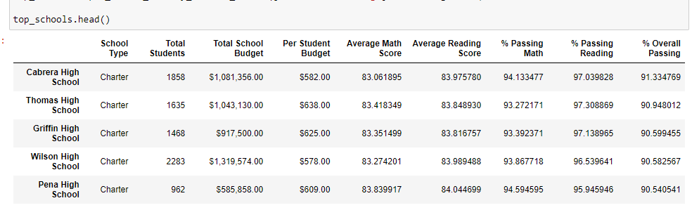
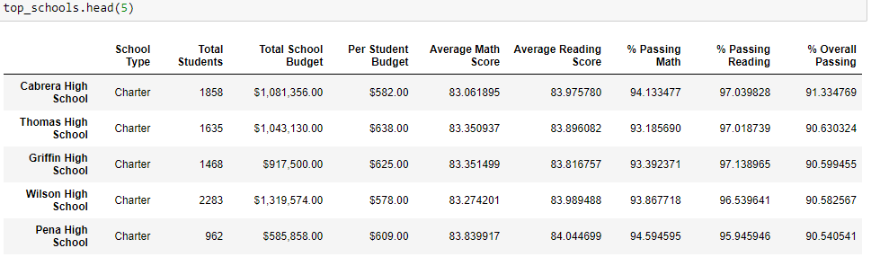
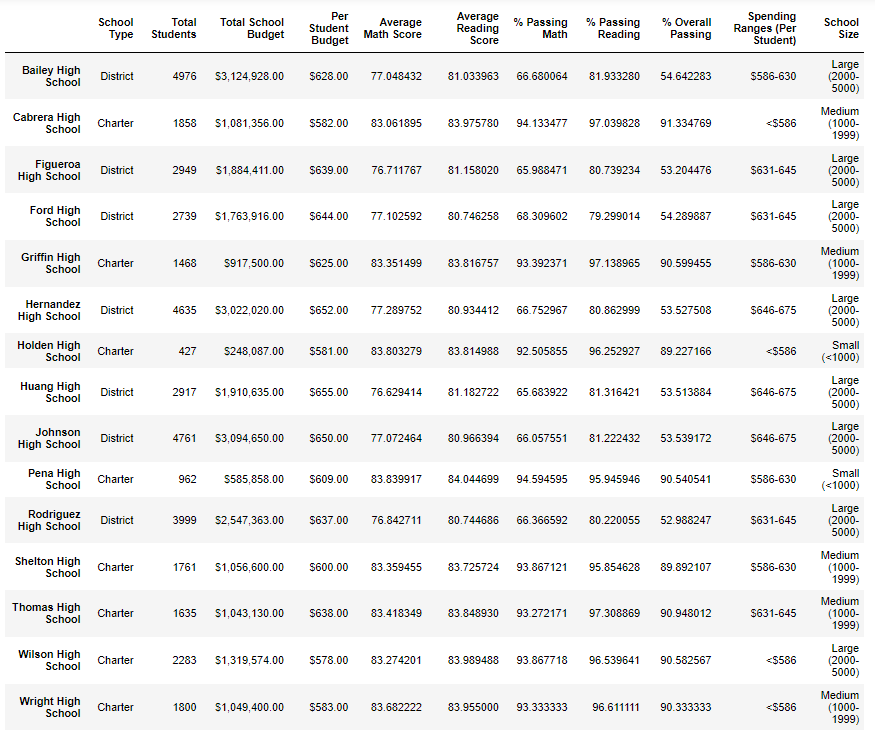
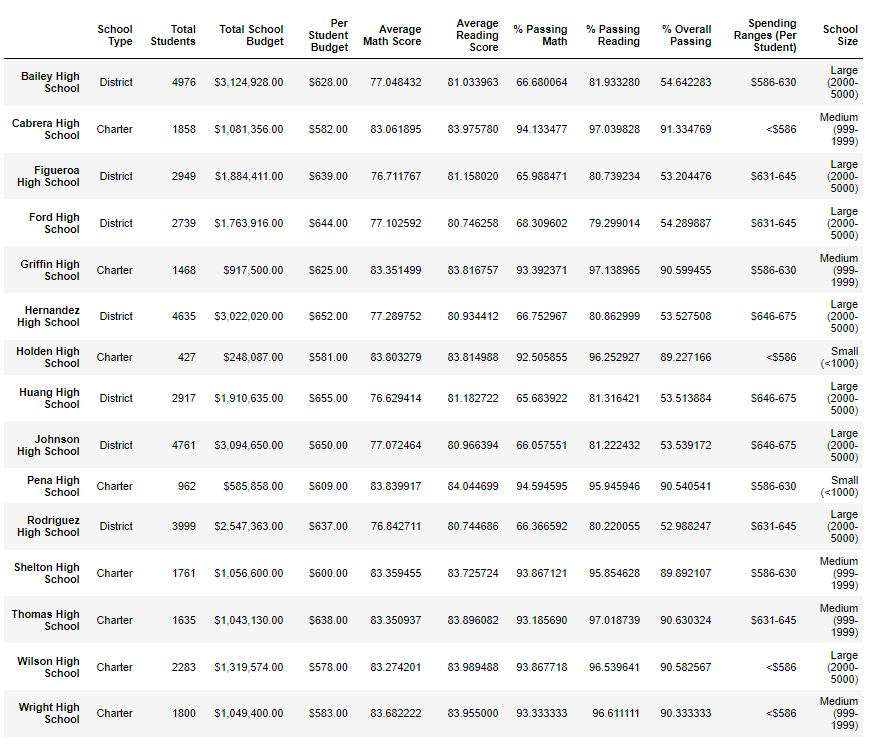

# Analysis on standardized test data for High Schools
## Purpose

Standardized test data for math and reading from various schools within a district were used to conduct an analysis. The purpose of this analysis was to provide insight on performance trends that would be used to aid in making decisions on both a school and district level.

## Results

### •	District Summary: 
By altering ninth-grade student data for Thomas High School, you could only see a slight change in the district summary data. This means ninth-grade scores for math and reading did not necessarily contribute or make a difference to the overall average of the school's scores.
           
The first image shows the district summary prior to changing ninth-grade math and reading scores to NaN. The second image is after the scores have been changed. When comparing the two images, it can be seen that there was no significant change to the data.

### •	School Summary

Similar to the results in the district summary, there is only a slight insignificant change to the overall scores and percentages of Thomas High School after removing the scores for ninth-graders.

The first image shows the school summary prior to changing ninth-grade math and reading scores to NaN. The second image is after the scores have been changed. 

### •	Affect on Thomas High School’s performance

By changing all ninth-grade scores to NaN, there was no major affect on the performance of Thomas High School. Below are images indicating the top 5 schools in the district. As seen below, the first image which is prior to changes to the ninth-grade scores indicates that Thomas High School is the second highest performing school. In the second image, which is after changes to the ninth-grade scores still shows Thomas High School as the second highest performing school. Thus it can be concluded that changing the ninth-grade scores did not affect the overall performance of Thomas High School.

### •	Affect on:
   o Math and reading scores
   o Scores by school spending
   o Scores by school size
   o Scores by school type

## Summary

There were four changes that occured when data for ninth-graders was changed to NaN: 

1. Number of total students in the district
2. Number of total students in Thomas High School
3. Average scores for math and reading
4. Overall percentages for math and reading

Although the changes listed above would seem to have a large affect on the overall results on the analysis, as seen above in the results section, there was no significant and detrimental affect on the dataset or overall analysis after making said changes.
