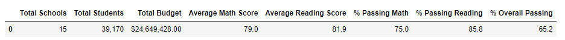

# School District Analysis (Give different title)
## Purpose

Standardized test data for math and reading from various schools within a district were used to conduct an analysis. The purpose of this analysis was to provide insight on performance trends that would be used to aid in making decisions on both a school and district level.

## Results

### •	District Summary: 
By altering ninth-grade student data for Thomas High School, you could only see a slight change in the district summary data. This means ninth-grade scores for math and reading did not necessarily contribute or make a difference to the overall average of the school's scores.
           
The first image shows the district summary prior to changing ninth-grade math and reading scores to NaN. The second image is after the scores have been changed. When comparing the two images, it can be seen that there was no significant change to the data.

### •	School Summary

Similar to the results in the district summary, there is only a slight insignificant change to the overall scores and percentages of Thomas High School after removing the scores for ninth-graders.

The first image shows the school summary prior to changing ninth-grade math and reading scores to NaN. The second image is after the scores have been changed. 

### •	Affect on Thomas High School’s performance
### •	Affect on:
    o	Math and reading scores:
    o	Scores by school spending:
    o	Scores by school size:
    o	Scores by school type:

## Summary
